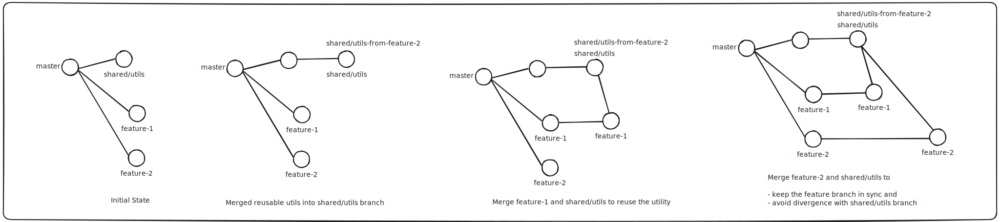

# The Shared Code Dilemma: Merging Features vs. Staying Isolated

In fast-paced product teams, it's common to have multiple engineers working in parallel on different features. This parallel development model improves velocity, but it introduces a subtle challenge: what happens when two or more features need to share code, like a utility function or custom hook?

Merging one feature branch into another just to reuse some code defeats the purpose of isolation. It risks entangling features, introduces unnecessary merge conflicts, and causes confusion about ownership and responsibilities.

In this article, we’ll explore why this happens and how to share reusable code between feature branches without merging them, using practical workflows that scale with your team.

> 💡 Assumption: This guide assumes you cannot utilize workspaces/monorepo setups, Git submodules, or internal/private npm (or similar language) packages—for technical, organizational, or legacy reasons. You’re essentially stuck with what you have, and what you have is a Git branching model without modular infrastructure.

## The Problem

Let’s set the scene:

- Person-A is working on feature-1
- Person-B is working on feature-2

Now, feature-2 has a utility function that’s also useful for feature-1. But we want to avoid merging feature-2 into feature-1, because:

- 🔀 It breaks the isolation of features
- 🪲 Bugfixes to the shared code become ambiguous: which branch should they go in?
- 😕 PRs become tangled and hard to review

So, what’s the alternative?

## The Clean Solution: A Shared Branch for Utilities

You can create a `shared/utils` branch to hold reusable logic. Each feature branch can pull from this shared branch without depending on each other.

### 🛠️ Workflow: Extract and Promote Shared Utilities

1. **Isolate Shared Logic in Feature Branch**

    From `feature-2`, isolate the commits that contain reusable code.

    > This allows you to promote just the reusable logic without dragging unrelated feature code. If the shared code is already bundled with feature logic, use `git rebase -i` (Interactive Rebase) to split it into a separate commit.

2. **Create a Shared Branch**

    Make sure to create the `shared/utils` branch from your main integration branch (like `master` or `production`)—the same branch from which you originally branched off your feature branches.

    ```bash
    # Fetch the latest changes from master
    git fetch origin master

    # Create shared/utils branch from master
    git switch -C shared/utils origin/master
    ```
    Or if it already exists:

    ```bash
    # Switch to shared/utils branch
    git switch shared/utils

    # Make sure it's up to date
    git pull origin shared/utils
    ```

3. **Create a New Branch to Push Changes**

    ```bash
    git switch -C shared/utils-from-feature-2 shared/utils
    ```

4. **Cherry-pick or Copy Shared Commits**

    ```bash
    git cherry-pick <commit-hash>
    ```

    Or manually copy utils into `shared/utils`

5. **Push and Open a PR**

    ```bash
    git push origin shared/utils-from-feature-2
    ```

    - Create a PR into `shared/utils`
    - Get it reviewed and merged

6. **Pull Shared Code into Feature Branches**

    After merging the shared utility code into `shared/utils`, you need to pull it into both the feature branches:
    - the one needing the functionality (`feature-1`)
    - the source feature branch (`feature-2`) to keep it in sync with the latest changes.

    ```bash
    # Switch to the feature branch (feature-1) where you need the shared code
    git switch feature-1

    # Pull in the latest changes from shared/utils
    git pull origin shared/utils

    # Switch to the source feature branch (feature-2) to keep it updated with the shared utils
    git switch feature-2

    # Pull in the latest changes from shared/utils into feature-2
    git pull origin shared/utils
    ```

    > Pulling shared/utils into `feature-1` lets you consume the shared logic. Pulling it into `feature-2` ensures the feature branch stays aligned with the promoted code and avoids divergence.

Now both `feature-1` and `feature-2` can use the same utility code—without merging each other’s branches.

## Other Approaches (If You Had the Infrastructure)

While this guide assumes you're limited to basic Git, it's helpful to be aware of more advanced strategies:

1. **Local Shared Package in a Monorepo**

    Use tools like Nx, Turborepo, or Yarn/PNPM workspaces:

    ```bash
    /packages
        /shared-utils
        /feature-1
        /feature-2
    ```

    Each feature imports from `@myorg/shared-utils`.

2. **Private Package Distribution**

    Extract shared utils into their own repository and publish them to a private registry or distribution channel supported by your language or platform (e.g., Python's private PyPI index, Java's Maven repos, Go's module proxy). Feature branches then install a specific version.

3. **Git Submodule or Subtree**

    Include shared utils as a submodule/subtree. Keep it versioned and sync changes across branches.

4. **Patch-Based Sharing**

    Use `git format-patch` to export shared commits and `git apply` them in other branches. Lightweight but manual.

## Final Thoughts

When your team grows, and so does your codebase, shared code can quickly become a point of contention. By intentionally isolating reusable logic in a shared space—whether it’s a branch, package, or module—you keep your development clean, collaborative, and conflict-free.

No more back-merging chaos. Just shared code, done right.

## Gotchas to Watch Out For

- ❗ Wherever possible, prefer using rebase over merge to keep history clean and linear.
- 🧹 Don't let your shared branch become a dumping ground—keep it tidy and scoped.
- 🧠 Communicate clearly in PRs when you're promoting shared logic.
- 🔁 Re-pull the `shared/utils` branch into both the source and consumer branches to stay in sync.


## Visualizing the Commit History

Below is a sample diagram of what your commit history might look like after following this process:



> This graph helps illustrate how `feature-1` and `feature-2` both branch off from `master`, pull from `shared/utils`, and continue independently while benefiting from shared code.